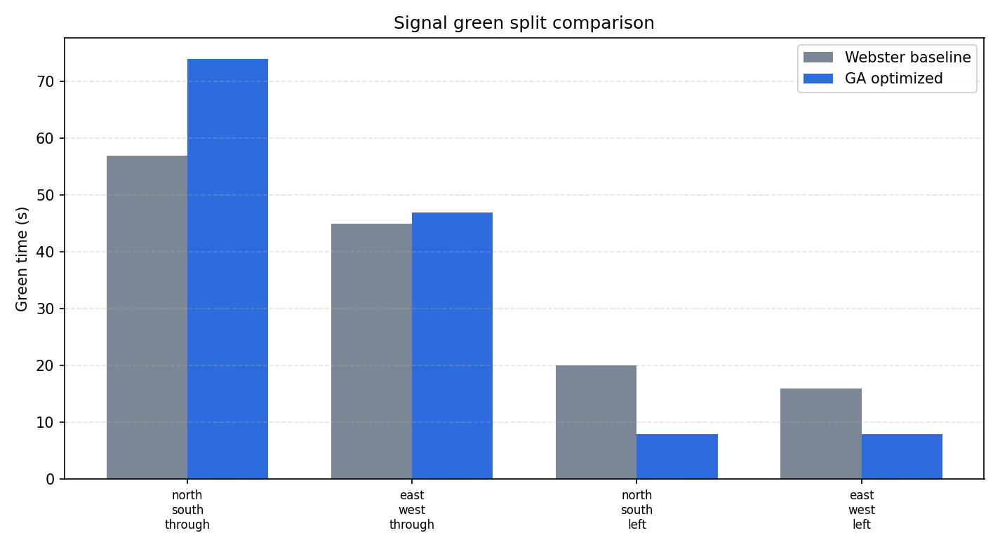
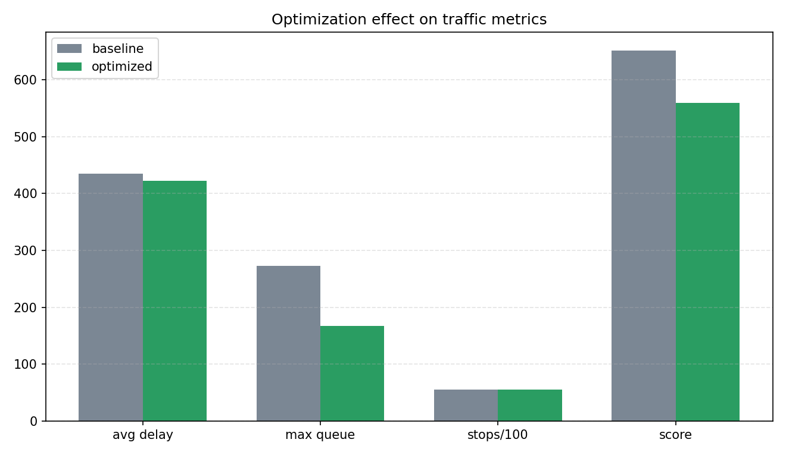
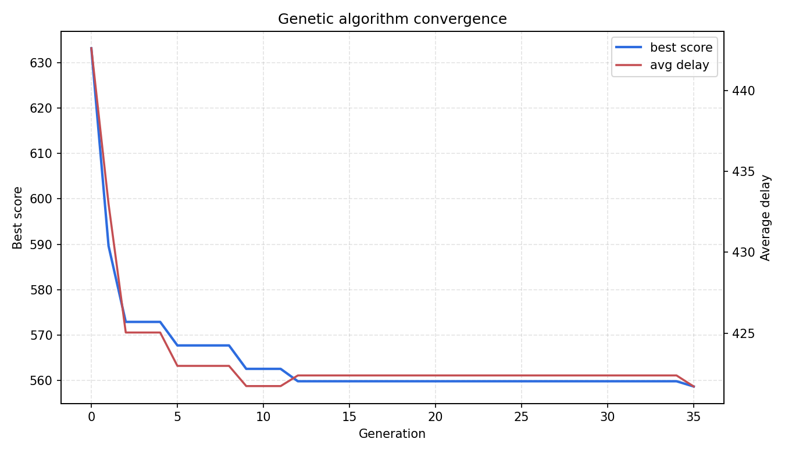

# 城市交叉口信号配时智能优化

本项目面向城市道路交叉口高峰期拥堵问题，构建四相位交通信号仿真环境，并使用遗传算法优化信号周期和各相位绿灯时间。项目以 Webster 固定配时作为基线方案，通过平均延误、最大排队长度、通行率、停车次数和综合评分等指标，对优化效果进行量化分析。

## 项目简介

城市交叉口在早晚高峰中常出现周期固定、绿灯分配不均、车辆排队增长和进口道通行能力不平衡等问题。本项目通过建立简化但可运行的交通流仿真模型，对不同进口方向的车辆到达、排队和放行过程进行模拟。

在此基础上，项目使用精英保留遗传算法搜索更优的信号周期和绿信比分配，使信号控制方案能够更贴近实际交通需求。

## 项目特点

- 构建四进口交叉口交通仿真场景。
- 包含南北直行、东西直行、南北左转、东西左转四个信号相位。
- 使用 Webster 固定配时作为基线方案。
- 使用遗传算法优化周期长度和绿信比分配。
- 统计平均延误、最大排队、通行率、停车次数和综合评分。
- 自动生成对比图片、收敛曲线、队列曲线和 GIF 动图。
- 提供完整源码、测试文件、运行结果和汇报页面。

## 文件结构

```text
src/smart_intersection_signal_optimization/
├── main.py                  # 命令行入口
├── scenario.py              # 交叉口场景、相位和 Webster 基线
├── simulator.py             # 队列演化仿真与指标计算
├── optimizer.py             # 遗传算法配时优化
├── visualization.py         # 图片、图表和 GIF 生成
├── requirements.txt         # 依赖说明
├── README.md                # 项目说明
├── assets/                  # 运行结果图片、动图和数据
└── tests/                   # 单元测试
```

## 运行方法

```bash
cd src/smart_intersection_signal_optimization
python main.py
```

运行后会在 `assets/` 目录下生成：

```text
optimized_queue_profiles.png          # 优化后各进口排队曲线
green_split_comparison.png            # 基线与优化绿信比分配对比
metric_comparison.png                 # 延误、排队、停车、综合评分对比
ga_convergence.png                    # 遗传算法收敛曲线
intersection_signal_optimization.gif  # 信号控制与排队动态演示
metrics.json                          # 汇总指标
optimized_greens.csv                  # 优化绿灯时间表
convergence.csv                       # 每代优化过程
```

## 核心流程

1. 构建四相位交叉口交通需求场景。
2. 根据 Webster 方法生成固定配时基线。
3. 使用队列演化模型模拟车辆到达、排队和放行。
4. 将信号周期和绿信比分配编码为遗传算法个体。
5. 通过选择、交叉、变异和精英保留迭代搜索更优方案。
6. 对比基线方案和优化方案的交通运行指标。
7. 输出图片、GIF、CSV、JSON 和文档汇报页面。

## 动态演示

下图展示了优化配时下交叉口各方向车辆排队随信号相位变化的过程。


## 实验结果

### 绿信比分配对比



### 指标对比



### 优化后排队曲线


### 遗传算法收敛曲线



## 运行结果示例

```text
Smart intersection signal optimization finished
Algorithm: elitist genetic algorithm
Baseline delay: 434.538
Optimized delay: 421.7
Delay reduction: 2.954%
Score reduction: 14.175%
Optimized cycle: 149s
```

## 创新点

相比普通信号灯动画，本项目不仅展示交通灯切换效果，还建立了完整的优化流程。项目将交通工程中的 Webster 配时方法、队列仿真模型和遗传算法结合起来，实现了从建模、仿真、优化、评估到可视化汇报的完整工程链路。

## 后续可扩展方向

- 将遗传算法替换为 DQN、PPO 或多智能体强化学习。
- 接入 SUMO、CARLA 或真实交通检测器数据。
- 增加行人相位、公交优先和应急车辆优先策略。
- 从单路口扩展到多路口区域协调控制。
- 加入早晚高峰动态需求变化，实现自适应信号控制。
